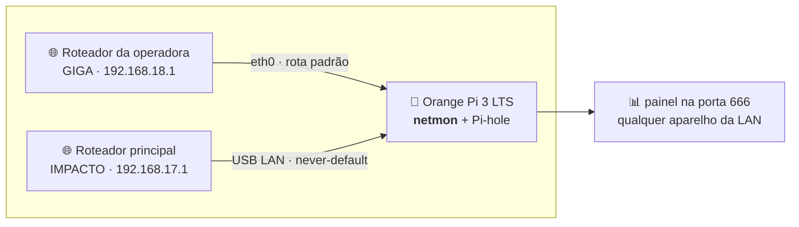

# 📡 netmon — quem caiu foi a internet ou foi você?

> Duas operadoras. Um Orange Pi de 2 GB. Zero dependências.
> Um painel que abre **justamente quando a internet cai** — porque não usa CDN,
> não usa Node, não usa pip, não usa nuvem.


---

## O drama que originou este projeto

Você liga para a operadora. Ela jura que está tudo perfeito.
Você diz que caiu. Ela pergunta se você já desligou e ligou o roteador.
Você desliga e liga o roteador. Ela diz que "o sinal está ótimo aqui".

O problema não é a queda. O problema é **não ter prova**.

Este projeto é a prova: dois links monitorados a cada **2 segundos**, com a
**hora exata** da queda (a do primeiro pacote perdido, não a da confirmação),
duração, causa provável e histórico que sobrevive a reboot. Quando você ligar
para a operadora, você tem um PDF.

```
┌─ GIGA ──────────────────── NO AR ─┐   ┌─ IMPACTO ────────────── NO AR ─┐
│  3.9 ms      0 %      0.2 ms      │   │  4.0 ms     0 %     0.4 ms     │
│  latência   perda    jitter       │   │  latência  perda   jitter      │
│  ╭─╮   ╭╮      ╭─╮                │   │      ╭╮   ╭─╮   ╭╮            │
│ ─╯ ╰───╯╰──────╯ ╰──── 99,98%     │   │ ─────╯╰───╯ ╰───╯╰─── 99,91%  │
│  estável há 3d 4h · gw ok         │   │  estável há 6h 12min · gw ok   │
└───────────────────────────────────┘   └────────────────────────────────┘
```

## A topologia (e por que ela complica tudo)



As duas redes são **cascateadas**, não paralelas — sair pelo adaptador USB é dar
a volta com NAT duplo. Por isso cada sonda é **presa à interface**
(`ping -I`, `SO_BINDTODEVICE`): nada vaza pela rota padrão nem pela VPN, e o
número medido é do link certo, sempre.

Trocar o cabo de lugar não quebra nada: IP e gateway são redetectados a cada
60 s. A identidade de um link é a **interface**, nunca um IP.

## O que ele faz

| | |
|---|---|
| 🔴 **Detecta queda em ~4 s** | 2 ciclos ruins nos dois alvos de ping. A hora registrada é a do **primeiro** ciclo ruim — a hora real em que caiu, não a da confirmação |
| 🟡 **Separa "caiu o provedor" de "caiu o roteador"** | pinga o gateway em paralelo; se ele responde e a internet não, a culpa é de lá |
| 🚀 **Testa a velocidade de cada link** | download e upload reais, um botão por internet |
| 📈 **Guarda 5 anos de histórico** | amostras de 2 s por 48 h, minuto por 90 dias, hora por 5 anos — e estabiliza abaixo de 70 MB |
| 📄 **Gera PDF** | escrito à mão em Python puro: não há reportlab nem navegador headless neste aparelho |
| 🔔 **Avisa no Discord/Slack** | webhook traduzido conforme o destino, e enviado **pelo outro link** se o principal estiver caído |
| 🔊 **Grita na página** | banner, som e notificação do navegador |

### Os números daqui de casa

| Link | ↓ download | ↑ upload | ping | jitter |
|---|---|---|---|---|
| **GIGA** (fibra, `eth0`) | 596 Mbps | 491 Mbps | 3,9 ms | 0,18 ms |
| **IMPACTO** (backup, USB LAN) | 6,7 Mbps | 5,8 Mbps | 4,1 ms | 0,36 ms |

Sim, o backup é lento. É backup.

(Uptime não entra na tabela porque este monitor é novo em folha — números de
disponibilidade só valem depois de umas boas semanas medindo.)

## "Mas por que não Grafana? Zabbix? Smokeping?"

Porque eu tentei. 😅

Grafana + Zabbix rodando neste Orange Pi deixaram o **load em 9,8** e a RAM
livre em **71 MB**. Desliguei os dois e escrevi isto: **20 MB de RAM e ~2,5% de
CPU**, load 1,5.

E tem o detalhe que nenhum painel bonito resolve: um dashboard que carrega
JavaScript de CDN é inútil **exatamente no minuto em que a internet cai**. Aqui
não há um único recurso externo — a página é HTML, CSS e JS servidos pelo
próprio aparelho, gráficos em SVG desenhados na unha.

## O que é medido, a cada 2 segundos

| Sonda | Frequência | Para quê |
|---|---|---|
| ICMP internet (2 alvos × 3 pacotes, em paralelo) | 2 s | latência min/méd/máx, jitter, perda |
| ICMP gateway (2 pacotes) | 2 s | separar queda do provedor da queda do roteador |
| DNS (consulta A crua, UDP) | 30 s | resolução real pelo link, sem passar no Pi-hole |
| TCP handshake :443 | 30 s | confirma que não é só ICMP passando |
| HTTP 204 | 60 s | pega bloqueio e portal cativo |
| Redetecção de IP e gateway | 60 s | sobrevive a troca de cabo e de rede |

As três sondas ICMP de cada ciclo rodam **juntas**. Em série, um ciclo com o
link caído custaria ~4,6 s de timeouts somados; em paralelo custa ~1,5 s — é o
que permite confirmar uma queda em 3–4 s.

## Teste de velocidade

Um botão por internet. Download e upload reais, com o soquete preso à interface
— só `socket` + `ssl` da biblioteca padrão (neste aparelho o Python sustenta
~450 Mbps, bem acima dos links).

- O começo de cada conexão é descartado: TCP em *slow start* ainda mente.
- Fonte primária `speed.cloudflare.com`; se ela responder `429` (muitos testes
  do mesmo IP), o download cai sozinho para `cachefly.cachefly.net`.
- O nome do servidor é resolvido por **DNS preso à interface** — senão testar o
  link secundário com o principal caído falharia logo na resolução.
- Enquanto o teste roda, o alerta de latência alta **daquele link** fica
  suspenso: o link está cheio por nossa conta. A detecção de **queda** continua.

## Quando dispara alerta

- **QUEDA** — 2 ciclos com 100% de perda nos dois alvos (~4 s).
- **RETORNO** — 3 ciclos bons (~6 s). Histerese assimétrica: é mais difícil
  voltar do que continuar caído, para não anunciar retorno em link instável.
- **LATÊNCIA ALTA** — média móvel acima do limiar (padrão 80 ms) por ~10 s, ou
  perda ≥ 20% por ~6 s, ou jitter > 60 ms. Pico acima de 3× o limiar avisa em ~4 s.
- **INSTÁVEL** — 3+ quedas em 10 min marcam *flapping* e seguram os webhooks até
  estabilizar.

O limiar de 80 ms é agressivo de propósito: os dois links ficam em ~4 ms, então
qualquer coisa acima disso já é anomalia gritante, não ruído.

## Instalação

Requisitos: Linux, **Python 3.10+** e duas interfaces de rede. Só isso.

```bash
git clone https://github.com/cleber-son/monitoramento-dual-internet-orangepi.git netmon
cd netmon
# ajuste os nomes das interfaces em db.py (LINKS)
./run.sh
```

Depois é só abrir `http://<ip-do-aparelho>:666/`.

Sobe sozinho no boot e se recupera de travamento pelo cron — aqui não há `sudo`
sem senha, então systemd de sistema está fora de alcance:

```cron
@reboot sleep 25; /caminho/netmon/run.sh
* * * * * /caminho/netmon/run.sh
```

O `run.sh` usa `flock`: se ninguém segura o lock ele vira o serviço; se já há
uma instância, ele confere `/api/health` e, após 3 falhas seguidas, mata o
processo travado para o minuto seguinte reerguer.

### Os dois comandos que exigem root

Rodam uma vez só; depois o sistema se vira sozinho.

**1. Rota do link secundário** — sem rota padrão naquela interface, nenhuma
sonda consegue sair por ela:

```bash
sudo nmcli connection modify enx-lan ipv4.never-default no ipv4.route-metric 700
sudo nmcli connection up enx-lan
```

A métrica 700 é alta de propósito: o link secundário entra como **backup**, o
principal continua sendo o caminho de tudo. Nada muda no uso normal da rede.

**2. Porta 666** — o kernel reserva portas abaixo de 1024:

```bash
echo 'net.ipv4.ip_unprivileged_port_start=666' | sudo tee /etc/sysctl.d/90-netmon.conf
sudo sysctl --system
```

Se a porta não estiver liberada, o serviço cai sozinho para a **8666** e a
página avisa no rodapé.

## API

| Rota | O que devolve |
|---|---|
| `GET /api/status` | estado atual dos 2 links, uptime 24h/7d/30d, evento aberto |
| `GET /api/samples?link=&from=&to=&res=auto` | série temporal (`raw`/`minute`/`hour`) |
| `GET /api/events?link=&tipo=&limit=&offset=` | histórico de quedas com duração |
| `GET /api/summary?period=24h` | uptime, nº de quedas, downtime, rtt, jitter, perda |
| `GET /api/speedtest?link=&limit=` | último teste de cada link, histórico e o que está rodando |
| `POST /api/speedtest` | dispara o teste: `{"link":"GIGA","dur":5}` — `409` se já houver um |
| `GET /api/config` · `POST /api/config` | limiares, webhook, som |
| `POST /api/webhook/test` | dispara um payload de teste |
| `GET /api/stream` | SSE ao vivo (`status` a cada 2 s, `alerta` na hora) |
| `GET /api/report.pdf?period=24h` | relatório em PDF |
| `GET /api/logs` | pacote de diagnóstico |
| `POST /api/reset` | apaga o histórico — exige `{"confirmar":"APAGAR"}` |

## Banco e retenção

SQLite em WAL, escritor único, commit em lote a cada 30 s para poupar o cartão
SD. A ponta ainda não gravada fica numa fila em memória e é servida junto pela
API — sem isso a janela de 30 s do painel apareceria vazia.

| Camada | Retenção | Tamanho |
|---|---|---|
| amostras de 2 s | 48 h | ~15 MB |
| média por minuto | 90 dias | ~25 MB |
| média por hora | 5 anos | ~17 MB |
| quedas e testes de velocidade | para sempre | < 2 MB |

Purga e checkpoint às 4h da manhã.

## Estrutura

```
netmon.py     entrypoint, threads, sinais
db.py         schema, escritor único, rollups, retenção
probe.py      sondas e máquina de estados
speedtest.py  teste de download/upload preso à interface
alerts.py     regras de alerta, webhook, barramento SSE
server.py     API HTTP, SSE, estáticos
pdf.py        escritor de PDF 1.4 feito à mão
report.py     montagem do relatório
run.sh        lock de instância única + watchdog
static/       index.html, app.js, style.css
```

## Detalhes que custaram caro para descobrir

- Os alvos de ping são `9.9.9.9` e `208.67.222.222` **de propósito**: existem
  rotas estáticas fixando `1.1.1.1` e `8.8.8.8` em `dev eth0`, o que falsearia a
  medição do outro link.
- O DNS medido nunca é `127.0.0.1`: mediria o Pi-hole local, não o link.
- O gateway é pingado com **2 pacotes, não 1**: a ONT descarta ~12% dos ICMP
  dirigidos a ela, e um único pacote perdido apontaria "roteador local" sem motivo.
- Sem bateria de RTC, o relógio volta para 1970 no boot — o que já derrubou o
  Pi-hole deste mesmo aparelho. Os horários do log seguem `America/Sao_Paulo`
  mesmo com o sistema em UTC, para bater com o painel na hora de investigar.

## Mais fundo

- [**Manual de operação**](docs/OPERACAO.md) — comandos do dia a dia, webhook do
  Discord passo a passo, formato do payload, reset e diagnóstico.

---

Feito em casa, num Orange Pi, para ganhar uma discussão com a operadora. 🍊
