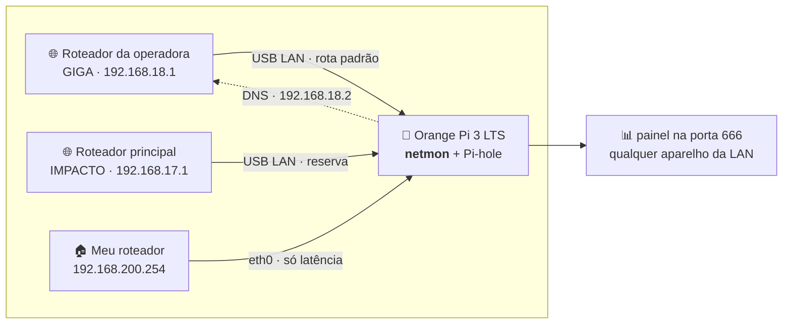

# 📡 netmon — quem caiu foi a internet ou foi você?

> Duas operadoras. Um Orange Pi de 2 GB. Zero dependências.
> Um painel que abre **justamente quando a internet cai** — porque não usa CDN,
> não usa Node, não usa pip, não usa nuvem.


---

## O drama que originou este projeto

Você liga para a operadora. Ela jura que está tudo perfeito.
Você diz que caiu. Ela pergunta se você já desligou e ligou o roteador.
Você desliga e liga o roteador. Ela diz que "o sinal está ótimo aqui".

O problema não é a queda. O problema é **não ter prova**.

Este projeto é a prova: dois links monitorados a cada **2 segundos**, com a
**hora exata** da queda (a do primeiro pacote perdido, não a da confirmação),
duração, causa provável e histórico que sobrevive a reboot. Quando você ligar
para a operadora, você tem um PDF.

```
┌─ GIGA ──────────────────── NO AR ─┐   ┌─ IMPACTO ────────────── NO AR ─┐
│  3.9 ms      0 %      0.2 ms      │   │  4.0 ms     0 %     0.4 ms     │
│  latência   perda    jitter       │   │  latência  perda   jitter      │
│  ╭─╮   ╭╮      ╭─╮                │   │      ╭╮   ╭─╮   ╭╮            │
│ ─╯ ╰───╯╰──────╯ ╰──── 99,98%     │   │ ─────╯╰───╯ ╰───╯╰─── 99,91%  │
│  estável há 3d 4h · gw ok         │   │  estável há 6h 12min · gw ok   │
└───────────────────────────────────┘   └────────────────────────────────┘
```

## A topologia (e por que ela complica tudo)



> **Qual placa é qual não está escrito em lugar nenhum.** O papel é decidido pelo
> **gateway** que o DHCP entrega, e as placas já trocaram de papel uma vez: as
> internets estão hoje nos adaptadores USB e a rede local voltou para a `eth0`.
> Por isso nenhum nome de interface aparece como verdade neste README.

Um detalhe que muda o risco de tudo: **este mesmo aparelho é o servidor DNS da
rede `192.168.18.0/24`**, em `192.168.18.2`, e o roteador principal fica atrás
dele — ou seja, a casa inteira depende deste Orange Pi para resolver nome.
Quando ele sai do ar, ou só troca de endereço, ninguém navega mesmo com as duas
internets perfeitas. É daí que vem a sonda de **DNS da LAN**, mais abaixo.

As duas redes são **cascateadas**, não paralelas — sair pelo adaptador USB é dar
a volta com NAT duplo. Por isso cada sonda é **presa à interface**
(`ping -I`, `SO_BINDTODEVICE`): nada vaza pela rota padrão nem pela VPN, e o
número medido é do link certo, sempre.

Trocar o cabo de lugar não quebra nada: IP e gateway são redetectados a cada
60 s. A identidade de um link é a **interface**, nunca um IP — e a interface de
cada link é escolhida **na página**, em Configurações → Placas de rede. Trocar o
adaptador USB por outro modelo é mudar um `<select>`: vale na hora, sem
reiniciar, e o histórico continua sendo do link, não da placa. A queda de
segundos entre uma placa e outra fica marcada como `troca_placa` e **não conta**
contra a operadora.

A terceira placa não mede internet: ela mede a **latência até o roteador de
casa** (`192.168.200.254`). É o que separa "a operadora caiu" de "a minha rede
caiu" — se a linha do ROTEADOR sobe junto com as outras duas, o problema é aqui
dentro. Esse link aparece no card de baixo, marcado como `LAN`, e fica fora dos
relatórios que vão para a operadora.

## O que ele faz

| | |
|---|---|
| 🔴 **Detecta queda em ~4 s** | 2 ciclos ruins nos dois alvos de ping. A hora registrada é a do **primeiro** ciclo ruim — a hora real em que caiu, não a da confirmação |
| 🟡 **Separa "caiu o provedor" de "caiu o roteador"** | pinga o gateway em paralelo; se ele responde e a internet não, a culpa é de lá |
| 🧭 **Vigia o DNS da LAN** | este aparelho é o servidor DNS da rede: uma sonda separada, pela rota normal, avisa quando ninguém consegue navegar apesar dos links no ar |
| 🚀 **Testa a velocidade de cada link** | download e upload reais, um botão por internet — e uma medição automática por dia, de madrugada |
| 🗺️ **Traça o caminho por cada internet** | traceroute próprio, sem root e sem o binário, com a bandeira do país de cada salto |
| 🕵️ **Varre a rede de casa** | quem está ligado agora: IP, MAC, fabricante pelo OUI, palpite do aparelho, cabo ou Wi-Fi e portas abertas — sem `nmap`, sem `arp-scan` e sem root |
| 🔗 **Mostra o Meshnet** | o acesso remoto a este aparelho, com quem está conectado e por qual operadora o túnel está saindo |
| 📈 **Guarda 5 anos de histórico** | amostras de 2 s por 48 h, minuto por 90 dias, hora por 5 anos — e estabiliza abaixo de 70 MB |
| 📄 **Gera o PDF da prova** | um botão por internet: hora exata de cada queda, duração e causa, para mandar à operadora. Escrito à mão em Python puro — não há reportlab nem navegador headless neste aparelho |
| 🔔 **Avisa no Discord/Slack** | webhook traduzido conforme o destino, e enviado **pelo outro link** se o principal estiver caído |
| 🔊 **Grita na página** | banner, som e notificação do navegador |

### Os números daqui de casa

Última medição das duas internets, no mesmo minuto:

| Link | ↓ download | ↑ upload | ping | jitter |
|---|---|---|---|---|
| **GIGA** (principal) | 111,4 Mbps | 174,1 Mbps | 4,40 ms | 0,13 ms |
| **IMPACTO** (reserva) | 106,0 Mbps | 180,7 Mbps | 4,48 ms | 0,18 ms |

E a latência contínua das sondas de 2 s:

| Link | rtt médio | jitter | perda |
|---|---|---|---|
| GIGA | 4,36 ms | 0,21 ms | 1,21% |
| IMPACTO | 3,02 ms | 0,18 ms | 0,20% |
| ROTEADOR (rede local) | 0,37 ms | 0,06 ms | 0% |

A GIGA é um plano de **1 Gb** e entrega ~120 Mbps: o teste de conexões em
paralelo, mais abaixo, mostra que o teto é da linha e não deste aparelho. É
justamente para isso que existe o teste diário automático — um número solto não
serve de argumento, uma série no mesmo horário serve.

## "Mas por que não Grafana? Zabbix? Smokeping?"

Porque eu tentei. 😅

Grafana + Zabbix rodando neste Orange Pi deixaram o **load em 9,8** e a RAM
livre em **71 MB**. Desliguei os dois e escrevi isto: **20 MB de RAM e ~2,5% de
CPU**, load 1,5.

E tem o detalhe que nenhum painel bonito resolve: um dashboard que carrega
JavaScript de CDN é inútil **exatamente no minuto em que a internet cai**. Aqui
não há um único recurso externo — a página é HTML, CSS e JS servidos pelo
próprio aparelho, gráficos em SVG desenhados na unha.

## O que é medido, a cada 2 segundos

| Sonda | Frequência | Para quê |
|---|---|---|
| ICMP internet (2 alvos × 3 pacotes, em paralelo) | 2 s | latência min/méd/máx, jitter, perda |
| ICMP gateway (2 pacotes) | 2 s | separar queda do provedor da queda do roteador |
| DNS (consulta A crua, UDP) | 30 s | resolução real pelo link, sem passar no Pi-hole |
| TCP handshake :443 | 30 s | confirma que não é só ICMP passando |
| HTTP 204 | 60 s | pega bloqueio e portal cativo |
| Redetecção de IP e gateway | 60 s | sobrevive a troca de cabo e de rede |
| IP externo (TLS em `1.1.1.1/cdn-cgi/trace`) | 5 min | o IP público **de cada link**, e o aviso quando ele muda |
| ICMP até o roteador de casa (link `LAN`) | 2 s | separa problema da operadora de problema da rede interna |
| **DNS da LAN**, pela rota normal | 30 s | descobre que ninguém está navegando mesmo com os links no ar |

O IP externo sai preso à interface, então cada link responde com o endereço que
o mundo realmente vê saindo por ele — é o número que a operadora pede no
atendimento. Ele é guardado no banco: depois de um restart o card já abre
preenchido, e uma troca de IP vai para o log.

As três sondas ICMP de cada ciclo rodam **juntas**. Em série, um ciclo com o
link caído custaria ~4,6 s de timeouts somados; em paralelo custa ~1,5 s — é o
que permite confirmar uma queda em 3–4 s.

## A sonda que faltava: o DNS da LAN

Todas as sondas acima são **presas à interface** e apontam para um resolvedor
público. Isso é certo para medir o *link* — e foi exatamente o que deixou o
painel cego no dia em que mais importava.

Em 30/08 as três linhas do painel ficaram verdes, `DNS 4,5 ms`, uptime intacto,
e **ninguém na casa conseguia abrir um site**. O que tinha quebrado era a rota
até os upstreams do Pi-hole e, depois, o endereço em que ele atendia — caminho
que nenhuma sonda de link percorre.

A sonda de DNS da LAN faz o contrário de todas as outras:

- vai pela **rota normal**, sem `SO_BINDTODEVICE` — é o caminho do resto da casa;
- pergunta a **todos** os endereços em que este aparelho serve DNS, não a um só.
  O roteador principal pergunta por um endereço e os aparelhos da rede da
  operadora perguntam por outro: vigiar um deixaria o outro cair em silêncio;
- descobre esses endereços sozinha, começando pelo **DNS que o DHCP anuncia** na
  rede (que é o que os aparelhos configuram) e aceitando apenas endereço privado
  — de um resolvedor público de emergência no `resolv.conf` sairia sempre "ok";
- consulta um **nome aleatório** a cada vez. Um nome fixo viria do cache do
  dnsmasq e o Pi-hole continuaria "respondendo" com os upstreams inalcançáveis,
  que é precisamente o estado a detectar. Resposta `NOERROR` ou `NXDOMAIN` conta
  como sucesso: qualquer uma das duas prova que a recursão saiu e voltou.

Duas falhas seguidas confirmam a queda e o alerta sai **nomeando o endereço**,
porque é isso que diz quem da casa ficou sem navegar. A pilha do topo da página
mostra o estado, e a seção **O que está sendo medido** lista cada servidor.

## Traceroute, sem root e sem `traceroute`

Este aparelho não tem `traceroute` nem `mtr`, e instalar exige senha. O caminho
é traçado com o que o kernel já dá de graça: soquete ICMP de datagrama
(liberado por `net.ipv4.ping_group_range`), `IP_TTL` para limitar os saltos e
`IP_RECVERR` + `MSG_ERRQUEUE` para ler o "tempo de vida excedido" com o endereço
de quem respondeu. As três consultas de cada salto vão em paralelo, em soquetes
separados: um salto mudo custa o timeout uma vez, não três.

O que torna isso útil aqui é o mesmo `SO_BINDTODEVICE` de sempre: **você escolhe
por qual internet sair**. Traçar o mesmo destino pelas duas operadoras e comparar
onde a latência dispara é o argumento que se leva para o atendimento:

```
GIGA    → 1.1.1.1    ... 172.16.100.113 → .118 → .122 → 172.68.16.111 🇧🇷 → 1.1.1.1 🇦🇺
IMPACTO → 1.1.1.1    ... 10.100.9.14 → 10.100.10.1 → 172.17.16.161 → 172.68.16.107 🇧🇷
```

Cada salto público mostra a **bandeira do país** — é o que revela o tráfego
saindo do Brasil cedo demais. O país é consultado uma vez por IP e guardado para
sempre: os saltos se repetem a cada traçado.

## NordVPN · Meshnet

Aqui a NordVPN **não serve para trocar de IP**. Serve para alcançar este Orange
Pi de fora, pelo Meshnet — e é por isso que o painel mostra o Meshnet, e não
"conectar a um servidor VPN". O que interessa é se o acesso remoto está de pé.

A seção mostra o estado, o apelido e o **IP do Meshnet** deste aparelho (é por
ele que você chega aqui de fora), a lista de aparelhos pareados com quem está
conectado, e **por qual operadora o túnel está saindo agora**. Esse último é o
detalhe que justifica a seção existir: o túnel sobe pela rota padrão, então se a
operadora principal cair ele volta sozinho pela reserva — e dá para ver isso
acontecendo.

O botão liga e desliga o Meshnet. O CLI `nordvpn` responde sem `sudo` porque o
usuário está no grupo `nordvpn`, o que torna o botão possível — e também
perigoso: **esta página não tem login**. Desligar o Meshnet corta o próprio
caminho de acesso remoto ao aparelho, e só dá para religar estando na rede
local. Por isso desligar exige confirmação na página e `{"confirmar":"DESLIGAR"}`
na API; ligar, que não tem risco, vai direto.

Cada chamada ao `nordvpn` conversa com um daemon e custa segundos, então o
estado é lido por uma thread em segundo plano e servido de um cache — abrir a
página não espera pelo daemon.

## Teste de velocidade

Um botão por internet. Download e upload reais, com o soquete preso à interface
— só `socket` + `ssl` da biblioteca padrão (neste aparelho o Python sustenta
~450 Mbps, bem acima dos links).

- O começo de cada conexão é descartado: TCP em *slow start* ainda mente.
- Fonte primária `speed.cloudflare.com`; se ela responder `429` (muitos testes
  do mesmo IP), o download cai sozinho para `cachefly.cachefly.net`.
- O nome do servidor é resolvido por **DNS preso à interface** — senão testar o
  link secundário com o principal caído falharia logo na resolução.
- Enquanto o teste roda, o alerta de latência alta **daquele link** fica
  suspenso: o link está cheio por nossa conta. A queda continua sendo detectada,
  mas se acontecer durante o teste ela é marcada como `teste_velocidade` e fica
  **fora do relatório da operadora** — num link de 6 Mbps saturado o ICMP morre,
  e isso é culpa nossa, não dela.

Todo teste, inclusive os que falharam, fica no **log de testes de velocidade**,
logo abaixo dos botões: hora, link, download, upload, ping, jitter, servidor
usado e o erro quando houve. Dá para filtrar por link e baixar tudo em CSV
(`;` como separador e vírgula decimal, do jeito que o Excel brasileiro espera).
Medir a velocidade do link `LAN` é recusado de propósito: mediria o cabo de
casa, não a internet contratada.

Há também um **teste automático, uma vez por dia** (padrão: 4h, ajustável em
Configurações). Roda de madrugada porque satura o link de propósito, e vai um
link de cada vez — medir os dois juntos disputaria a mesma CPU e as duas medidas
sairiam menores que a verdade. Cada teste fica marcado como `manual` ou
`automático` no log e no CSV, e a marca do dia fica no banco: se o aparelho
estiver desligado às 4h, o teste sai quando ele voltar, e não duas vezes se o
serviço reiniciar às 4h05. É o histórico que se leva para a operadora — a
velocidade entregue todo dia, no mesmo horário.

### O horário agendado é o SEU, não o do relógio do aparelho

**Esta armadilha já custou três dias de teste no horário errado.** O Orange Pi
roda em **UTC** (`timedatectl` diz `Etc/UTC`) e a casa está em
`America/Sao_Paulo`. O agendador usava `time.localtime()`, que aqui devolve UTC:
"4h" virava 04:00 UTC = **01:00 de Brasília**. E como a página formata no fuso do
*navegador*, o log mostrava 01:00 — parecia que o agendador simplesmente ignorava
a configuração.

Todo horário agendado passa por `netmon._agora()`, que usa o mesmo fuso do
painel, do log e do relatório (`alerts.TZ`). **Nunca use `time.localtime()` no
netmon** — nem para agendar, nem para montar a data do "já rodou hoje".

## Varredura automática da rede

Um retrato por dia de quem está ligado na rede, no horário escolhido (padrão
**14h**). Ao contrário do teste de velocidade, roda **de tarde de propósito**: de
madrugada metade dos aparelhos da casa está dormindo e não responde nem ao ARP, e
a lista sairia mentindo por omissão. Custa poucos segundos de CPU e não satura
link nenhum.

Sem rede escolhida, ela varre **a rede de casa** (o link `kind='lan'`) — as redes
das operadoras só têm o roteador delas e o próprio Pi, e não é sobre elas que se
pergunta "quem entrou aqui?". Se a rede gravada sumir com uma troca de placa, o
agendador cai de volta para a LAN em vez de travar.

### Novo na semana ≠ novo nesta varredura

São duas coisas diferentes e a distinção é o que faz o destaque valer:

| Marca | O que quer dizer |
|---|---|
| `novo` — *estreou agora* | apareceu **nesta** varredura e some na próxima |
| `novo_semana` — **ouro** | chegou nos **últimos 7 dias**; é o que se quer ver de relance |
| `fundador` | já estava aqui quando o netmon começou a olhar — **nunca** é novidade |

O `fundador` existe porque sem ele a primeira varredura pintaria a casa inteira
de ouro: todo aparelho conhecido teria `primeiro` recente. "Novidade" é por
**rede**, não global — a primeira varredura de uma rede cadastra 13 aparelhos de
uma vez, e anunciar 13 novos seria ruído. `scan.migrar_fundadores()` roda uma vez
no boot e marca quem já estava cadastrado antes desta ideia existir.

O `novo_semana` é **recalculado a cada leitura**, nunca guardado junto do retrato
da varredura: ele depende da hora atual e envelheceria errado dentro do JSON.

### O log das varreduras

`scan:ultimo:*` na `meta` guarda só o **último retrato** de cada rede,
sobrescrito toda vez. A tabela `scans` é o que sobra dele: quando rodou, se foi
você ou o agendador, quantos aparelhos achou, quanto levou, e **quem apareceu**
naquele dia — com nome e fabricante congelados, porque daqui a um mês o retrato
já foi substituído. Aparece na página (Aparelhos na rede → Log das varreduras),
no PDF e no pacote de diagnóstico.

## A página

**Toda seção recolhe no clique do título**, e o estado fica no navegador de quem
olha, não no aparelho — cada um tem o seu. Vêm fechadas por padrão as que são
consulta ocasional: NordVPN, "O que está sendo medido", histórico de quedas,
configurações e manutenção. O resumo continua visível com a seção fechada, então
dá para ver `Meshnet: ativo` ou `ping 8.8.8.8 · DNS da LAN 192.168.18.2` sem
abrir nada.

Não dá para fazer isso com `<details>` nativo: as seções de latência e traceroute
têm campos no cabeçalho (`<select>`, `<input>`, os botões de período), e clicar
num campo dentro de um `<summary>` fecha a seção. Por isso o JavaScript separa
cada painel em cabeça e corpo.

Um cuidado que não é óbvio: um `<svg>` dentro de seção fechada mede **0 px**.
Ao reabrir, o desenho tem que ser refeito, senão aparece na escala errada.

## O período manda em tudo

O seletor de período era um detalhe dentro do painel de latência, e parecia
mandar só ali. Agora é um **bloco próprio, o primeiro da página — antes até dos
cartões dos links** — e tudo o que fala de tempo (latência, perda, estatísticas,
linha do tempo e o histórico de quedas) fala da mesma janela. Ele vem antes dos
cartões porque é a pergunta que se faz primeiro: *de que pedaço de tempo estamos
falando?* Os cartões continuam sendo o estado de **agora** — só o resumo de
quedas dentro do bloco segue o período:

`ao vivo` · `1 min` · `10 min` · `30 min` · `1 h` · `2 h` · `24 h` · `2 dias` ·
`7 dias` · `30 dias` · `tudo`

- **Ao vivo** é o padrão: janela deslizante de 2 minutos, redesenhada a cada
  ciclo de sondagem (2 s). É o modo de olhar enquanto o problema acontece.
- **Tudo** começa na amostra mais antiga que o banco ainda guarda — o
  `/api/status` responde `inicio_dados` para a página saber onde é isso.
- A escolha fica no `localStorage`: dá F5 e o período continua o mesmo.
- A cadência de recarga segue a janela: 2 s ao vivo, 10 s até uma hora, 60 s
  daí para cima. Redesenhar 30 dias a cada 2 segundos só gastaria CPU do
  Orange Pi.

### O destaque da queda

A pergunta que se faz ao escolher um período é sempre a mesma: **caiu? quantas
vezes? por quantos segundos?** Isso estava diluído numa tabela de 13 métricas.
Agora é a primeira coisa que se lê, um cartão por link, com os segundos cheios
(é assim que a operadora conta) e a duração humana ao lado — mais o número de
quedas, a maior delas e o uptime da janela. Link caído neste instante ganha uma
linha "fora do ar AGORA há tanto tempo".

Duas causas continuam **fora da conta**, porque em nenhuma delas a operadora tem
culpa: a queda provocada pelo próprio teste de velocidade e o buraco de segundos
ao trocar a placa de rede do link.

## Aparelhos na rede

O monitor sabia tudo sobre os dois canos de internet e nada sobre a casa. A
varredura preenche o outro lado: **quem está ligado aqui dentro**, com IP, MAC,
fabricante, palpite do que é o aparelho, cabo ou Wi-Fi e portas abertas.

Neste aparelho não existe `nmap`, não existe `arp-scan` e `sudo` pede senha.
Então:

| O quê | Como, sem root |
|---|---|
| **Descoberta** | um único soquete ICMP de datagrama (o mesmo truque do traceroute) dispara um echo para cada endereço da faixa — e junto vai um datagrama UDP vazio para a porta 9, **só para obrigar o kernel a resolver o ARP** de quem não responde |
| **Quem está calado** | `ip neigh` depois da varredura. Foi o que levou esta casa de 7 aparelhos (só ICMP) para 12: celular com firewall não responde ao ping, mas **precisa** responder ao ARP para existir na rede |
| **Fabricante** | prefixo do MAC. Tabela local com os fabricantes comuns por aqui + API pública, com cache permanente no banco (`oui:*`) — a fonte gratuita corta em ~1 consulta por segundo |
| **Cabo ou Wi-Fi** | **palpite pela latência**, e a página diz isso. Aqui o cabo responde em 0,17–0,49 ms com desvio de 0,03–0,15 ms; o Wi-Fi, em 2,8–3,7 ms com desvio de 0,39–0,75 ms. Entre os dois fica a faixa honesta do "não dá para afirmar" |
| **Portas** | `connect()` de TCP comum, prazo de 0,7 s, 24 em paralelo. Lista curta escolhida pelo que **diz** do aparelho (9100 é impressora, 62078 é iPhone, 554 é câmera, 32400 é Plex) ou lista completa |
| **O que é o aparelho** | portas primeiro, fabricante depois. Gateway e o próprio Orange Pi são reconhecidos direto |

Tudo preso à interface (`SO_BINDTODEVICE`): varrer a rede da GIGA não pode sair
pela IMPACTO só porque ela é a rota padrão. Dá para varrer qualquer uma das três
redes — a LAN de casa, a da GIGA e a da IMPACTO.

**A consulta de fabricante é a exceção**: ela sai pela rota padrão, não pela
placa varrida. A `eth0` daqui é só rede local, sem rota default nenhuma — prender
o soquete nela fazia toda consulta morrer no timeout e gravar "fabricante
desconhecido" no cache permanente, que é pior do que não ter consultado.

Nesta rede **nem PTR, nem NetBIOS, nem mDNS respondem** (foi testado). Por isso o
nome do aparelho é um **apelido que você dá**, clicando no nome na tabela: fica
guardado pelo MAC, sobrevive à troca de IP e não se perde no reset do histórico.
Quem chegou nos últimos 7 dias fica **destacado em ouro**, com etiqueta escrita
e a idade em texto ao lado da data — a cor nunca vai sozinha, senão a informação
se perde na impressão em preto-e-branco e para quem não distingue amarelo. A data
da primeira vez em que o aparelho foi visto fica na última coluna.

O botão **📄 Salvar em PDF** gera o inventário da rede: resumo (quantos
aparelhos, por cabo, por Wi-Fi, quantos novos na semana), a tabela inteira com os
novos destacados e uma página final com o log das varreduras.

Uma varredura de /24 leva ~7 s com o cache de fabricantes quente (a primeira,
com MACs novos, chega a 20 s por causa do limite de 1 consulta por segundo).

## O gráfico de latência

Era linha de 2 px sobre uma faixa mín–máx, em 280 px de altura, e mais nada: com
os três links marcando entre 0,3 e 4 ms, as linhas se empilhavam numa faixa de
poucos pixels e saber quanto cada um marcava **agora** exigia passar o mouse.
Mudou de tamanho e de modelo:

- **400 px de altura** (280 no celular) — a faixa mín–máx precisa de espaço para
  existir;
- **área com degradê** sob cada linha: o volume separa os links de relance,
  coisa que duas linhas encostadas não fazem;
- **rótulo direto na ponta direita**, com o nome do link e o valor de agora. São
  três séries, então cada uma é rotulada: a identidade nunca depende só da cor.
  Quando dois valores quase coincidem — e coincidem quase sempre — os rótulos se
  empurram para não se sobrepor. Em tela estreita eles não cabem e a legenda do
  topo volta a ser a única;
- **marcador na última medida**, com anel da cor do fundo, senão dois pontos
  encostados viram uma mancha só;
- **linha tracejada no limiar de latência alta**, para o número ter régua — mas
  só quando ela cabe na escala atual. Esticar o eixo até 80 ms para mostrar a
  régua achataria contra o chão os 4 ms do dia a dia;
- **grade só horizontal**: as verticais competiam com as próprias linhas de dados
  agora que há área pintada;
- **suavização monótona (Hermite)** quando os pontos são esparsos. Monótona
  porque a spline ingênua "estoura" a curva entre dois pontos e desenha uma
  latência que nunca foi medida. Em janela ao vivo, com um ponto a cada 2 s, não
  há o que suavizar e o custo não se paga — a suavização só entra abaixo de um
  ponto a cada 6 px.

### O ROTEADOR mudou de cor, e não foi gosto

O link de LAN era violeta (`#a98bff`) e a GIGA é azul (`#4da3ff`). Passando as
duas pelo simulador de daltonismo (Machado–Oliveira–Fernandes, severidade 1,0) e
medindo a distância em OKLab ×100:

| Par | Visão normal | Protanopia | Deuteranopia |
|---|---|---|---|
| GIGA × ROTEADOR **antes** (`#a98bff`) | 11,5 | 3,6 | **1,5** |
| GIGA × ROTEADOR **agora** (`#37d6d6`) | 16,8 | 20,9 | **15,9** |

O piso é 15 para visão normal e 8 sob simulação. As duas linhas eram
**literalmente a mesma cor** para quem tem deuteranopia, e mesmo com visão normal
ficavam abaixo do piso — num gráfico onde elas se cruzam o tempo todo. O ciano
abre as duas e ainda fica a 13,4 do verde de "no ar", que é o vizinho perigoso
seguinte. A troca vale na página inteira: cards, legenda, linha do tempo e
gráfico usam a mesma constante.

## Perda de pacotes não é gráfico

Perda fica em zero quase o tempo todo. Num gráfico de linha isso vira um traço
rente ao eixo — invisível justamente no dia em que existe. Por isso ela é uma
**faixa por link**: cada bloco é um intervalo do período, colorido pela
gravidade, guardando o **pior** valor daquele intervalo (a média esconderia o
pico, que é o que se procura). Um episódio de dois minutos dentro de 24 h
continua sendo um bloco visível.

## Quando dispara alerta

- **QUEDA** — 2 ciclos com 100% de perda nos dois alvos (~4 s).
- **RETORNO** — 3 ciclos bons (~6 s). Histerese assimétrica: é mais difícil
  voltar do que continuar caído, para não anunciar retorno em link instável.
- **LATÊNCIA ALTA** — média móvel acima do limiar (padrão 80 ms) por ~10 s, ou
  perda ≥ 20% por ~6 s, ou jitter > 60 ms. Pico acima de 3× o limiar avisa em ~4 s.
- **INSTÁVEL** — 3+ quedas em 10 min marcam *flapping* e seguram os webhooks até
  estabilizar.
- **DNS DA CASA** — 2 falhas seguidas (~60 s) em qualquer um dos endereços em que
  este aparelho serve DNS. O aviso diz **qual** endereço parou, porque os links
  podem estar impecáveis e ninguém conseguir navegar.

O limiar de 80 ms é agressivo de propósito: os dois links ficam em ~4 ms, então
qualquer coisa acima disso já é anomalia gritante, não ruído.

## Instalação

Requisitos: Linux, **Python 3.10+** e duas interfaces de rede. Só isso.

```bash
git clone https://github.com/cleber-son/monitoramento-dual-internet-orangepi.git netmon
cd netmon
# os nomes de interface em db.py (LINKS) são só o padrão da primeira instalação;
# depois disso a escolha é feita na página, em Configurações → Placas de rede
./run.sh
```

Depois é só abrir `http://<ip-do-aparelho>:666/`.

Sobe sozinho no boot e se recupera de travamento pelo cron — aqui não há `sudo`
sem senha, então systemd de sistema está fora de alcance:

```cron
@reboot sleep 25; /caminho/netmon/run.sh
* * * * * /caminho/netmon/run.sh
```

O `run.sh` usa `flock`: se ninguém segura o lock ele vira o serviço; se já há
uma instância, ele confere `/api/health` e, após 3 falhas seguidas, mata o
processo travado para o minuto seguinte reerguer.

### O que exige root

Roda uma vez; depois o sistema se vira sozinho.

**1. Papéis de rede por gateway** — quem é a internet principal, quem é a
reserva e quem é a rede local:

```bash
sudo /home/orangepi/netmon/configurar-rede.sh
```

O script instala um *dispatcher* do NetworkManager que decide o papel de cada
placa pelo **gateway** que o DHCP entrega, não pelo nome da interface. Depois
disso, trocar o cabo de porta não exige configuração nenhuma: a rota padrão
continua na operadora certa sozinha.

A tabela `/etc/netmon-rede.conf` aceita um terceiro campo — um **endereço de
serviço** que este aparelho precisa ter naquela rede, seja qual for a placa:

```
192.168.18.1    100  192.168.18.2/24   # GIGA - principal + IP do Pi-hole
192.168.17.1    700                    # IMPACTO - reserva
192.168.200.254 lan                    # roteador de casa
```

É o IP do Pi-hole. O roteador da GIGA anuncia `192.168.18.2` como servidor DNS
para a rede inteira, então esse endereço tem que **seguir o cabo da GIGA**. O
dispatcher o adiciona na placa que estiver naquele gateway e o remove de
qualquer outra — deixá-lo preso ao perfil de uma placa foi o que derrubou o DNS
da casa nas duas vezes em que o cabo mudou de porta. Ele grava os arquivos de forma atômica e
confere o tamanho no fim — um dispatcher de zero byte já passou meses sem
aplicar métrica nenhuma, sem dar erro.

**2. Porta 666** — o kernel reserva portas abaixo de 1024:

```bash
echo 'net.ipv4.ip_unprivileged_port_start=666' | sudo tee /etc/sysctl.d/90-netmon.conf
sudo sysctl --system
```

Se a porta não estiver liberada, o serviço cai sozinho para a **8666** e a
página avisa no rodapé.

**3. Endereço fixo do DNS** — só se este aparelho servir DNS para a rede, como
aqui. O endereço que os clientes recebem por DHCP **não pode** depender de uma
reserva amarrada ao MAC: trocar de adaptador troca o MAC e a rede inteira fica
apontando para um endereço vazio.

```bash
sudo nmcli con mod "<perfil da placa>" +ipv4.addresses 192.168.18.2/24
sudo nmcli con up  "<perfil da placa>"
```

O `+` é importante: adiciona o endereço fixo **mantendo** o DHCP, então o
roteamento continua exatamente como estava.

## API

| Rota | O que devolve |
|---|---|
| `GET /api/status` | estado atual de cada link, IP externo, uptime 24h/7d/30d, evento aberto, `inicio_dados` |
| `GET /api/samples?link=&from=&to=&res=auto` | série temporal (`raw`/`minute`/`hour`) |
| `GET /api/events?link=&tipo=&from=&to=&limit=&offset=` | histórico de quedas com duração |
| `GET /api/summary?period=24h` | uptime, nº de quedas, downtime, rtt, jitter, perda |
| `GET /api/speedtest?link=&limit=` | último teste de cada link, histórico e o que está rodando |
| `POST /api/speedtest` | dispara o teste: `{"link":"GIGA","dur":5}` — `409` se já houver um |
| `GET /api/speedtest.csv?link=` | o log inteiro dos testes em CSV |
| `GET /api/traceroute?link=` | último traçado de cada link, e o que está rodando |
| `POST /api/traceroute` | traça o caminho saindo por um link: `{"link":"GIGA","destino":"1.1.1.1"}` |
| `GET /api/scan?rede=` | redes que dá para varrer, a última varredura e os apelidos guardados |
| `POST /api/scan` | varre: `{"rede":"eth0\|192.168.200.0/24","portas":"rapido"}` — `409` se já houver uma |
| `POST /api/scan/nome` | batiza um aparelho: `{"mac":"d4:0d:ab:46:4b:cc","nome":"TV da sala"}` |
| `GET /api/scan/log?limit=&rede=` | histórico das varreduras, com quem apareceu em cada uma |
| `GET /api/scan.pdf?rede=` | inventário dos aparelhos em PDF, com os novos da semana destacados |
| `GET /api/alvos` | para onde cada sonda aponta e o estado de cada servidor DNS da LAN |
| `GET /api/mesh` | estado do Meshnet, pares, e por qual link o túnel está saindo |
| `POST /api/mesh` | liga/desliga: `{"meshnet":true}` — desligar exige `{"confirmar":"DESLIGAR"}` |
| `GET /api/config` · `POST /api/config` | limiares, webhook, som, teste de velocidade automático, varredura automática |
| `GET /api/links` | links, a placa de cada um e todas as placas do sistema |
| `POST /api/links` | troca a placa (e o alvo do link LAN) ao vivo: `{"links":{"GIGA":{"iface":"eth0"}}}` |
| `GET /api/ifaces` | só as placas de rede, com IP, gateway, USB e estado do cabo |
| `POST /api/webhook/test` | dispara um payload de teste |
| `GET /api/stream` | SSE ao vivo (`status` a cada 2 s, `alerta` na hora, e o andamento de `speedtest`, `traceroute` e `varredura`) |
| `GET /api/report.pdf?period=24h&link=GIGA` | relatório em PDF; com `link`, só as quedas daquele link |
| `GET /api/logs` | pacote de diagnóstico |
| `POST /api/reset` | apaga o histórico — exige `{"confirmar":"APAGAR"}` |

## Banco e retenção

SQLite em WAL, escritor único, commit em lote a cada 30 s para poupar o cartão
SD. A ponta ainda não gravada fica numa fila em memória e é servida junto pela
API — sem isso a janela de 30 s do painel apareceria vazia.

| Camada | Retenção | Tamanho |
|---|---|---|
| amostras de 2 s | 48 h | ~15 MB |
| média por minuto | 90 dias | ~25 MB |
| média por hora | 5 anos | ~17 MB |
| quedas e testes de velocidade | para sempre | < 2 MB |

Purga e checkpoint às 4h da manhã.

## Estrutura

```
netmon.py     entrypoint, threads, sinais
db.py         schema, escritor único, rollups, retenção
probe.py      sondas e máquina de estados
speedtest.py  teste de download/upload preso à interface
alerts.py     regras de alerta, webhook, barramento SSE
server.py     API HTTP, SSE, estáticos
trace.py      traceroute próprio, sem root e sem o binário `traceroute`
mesh.py       estado e liga/desliga do NordVPN Meshnet
scan.py       varredura da rede local (ICMP + ARP + portas + fabricante)
pdf.py        escritor de PDF 1.4 feito à mão
report.py     montagem do relatório de quedas e do inventário da rede
run.sh              lock de instância única + watchdog
configurar-rede.sh  papéis de rede por gateway (dispatcher do NetworkManager)
static/       index.html, app.js, style.css
```

## Detalhes que custaram caro para descobrir

- **O relógio deste aparelho está em UTC e o usuário não.** `time.localtime()`
  aqui devolve UTC: qualquer agendamento feito com ele sai **3 horas antes** do
  que a configuração diz, e a página, que formata no fuso do navegador, mostra o
  horário errado e parece um agendador quebrado. Passe sempre por
  `netmon._agora()` (`alerts.TZ`). Levou três dias de teste de velocidade às 1h
  para alguém reparar.
- Os alvos de ping são `8.8.8.8` e `9.9.9.9`, **de donos diferentes de
  propósito**: o segundo só entra quando o primeiro some por completo, e usar o
  mesmo dono nos dois faria uma queda da Google parecer queda do link. O
  `8.8.8.8` já foi evitado aqui, porque havia rotas estáticas fixando esse IP
  numa única placa — medir a outra operadora por ele daria um número falso.
  Essas rotas foram removidas, e a remoção teve um motivo maior: depois que uma
  placa trocou de papel, elas apontavam para um gateway inalcançável e
  **derrubaram o DNS da LAN inteira**. Rota estática gravada em perfil do
  NetworkManager sobrevive a reboot e não aparece num `nmcli con show` resumido.
  Se um dia voltarem, o alvo volta a mentir: `ip route show | grep 8.8.8.8`.
- **O primeiro ping de cada aparelho mente.** Na varredura da rede, o pacote que
  inaugura a conversa espera a resolução do ARP e volta inflado — um celular que
  responde em 3 ms apareceu com **177 ms**. Qualquer julgamento feito sobre esse
  número (cabo ou Wi-Fi, por exemplo) sai errado. A descoberta guarda só o
  **menor** tempo visto, e quem é encontrado leva uma rajada de 5 pings depois,
  com o ARP já resolvido — é essa segunda medida que vale.
- **Cache permanente guarda o erro junto com o acerto.** A consulta de fabricante
  saía presa à placa varrida; para a `eth0`, que é só rede local e não tem rota
  default, toda consulta morria no timeout — e o "não achei" ia para o cache
  permanente. O resultado é pior do que não ter cache: os aparelhos ficavam
  marcados como fabricante desconhecido *para sempre*, sem nova tentativa. A
  consulta agora sai pela rota padrão, e as entradas envenenadas tiveram de ser
  apagadas à mão (`DELETE FROM meta WHERE key LIKE 'oui:%'`).
- **O log do Pi-hole engana na hora de investigar**: o conteúdo é gravado em
  **horário local**, mas os `mtime` dos arquivos dentro do container saem em
  **UTC**. Misturar os dois faz analisar uma janela três horas fora do
  incidente — e o log parece provar exatamente o contrário do que aconteceu.
  Confira sempre com `date` antes de recortar um intervalo.
- **`tail` largo atravessa o incidente.** Num arquivo de 68 MB, `tail -3000`
  alcançou o período *anterior* à queda, e as consultas de lá pareciam prova de
  que o serviço continuava atendendo durante o apagão. O que resolve a dúvida é
  contar por minuto dentro da janela exata (`awk` no campo da hora), não olhar o
  fim do arquivo. Foi assim que ficou claro que o roteador da casa passou o
  apagão inteiro **mudo** — zero consultas — e disparou 1331 de uma vez no
  minuto em que o endereço voltou.
- **Uma troca CRUZADA de cabos não dispara nenhum alarme.** A reconciliação só
  agia quando uma placa parecia doente — sem IP, sem gateway, sumida do sistema.
  Trocando os cabos de duas placas entre si, as duas continuam saudáveis: nada
  parece errado e os rótulos ficam invertidos em silêncio, atribuindo as
  medições à operadora errada. Pior, a memória de gateway era reaprendida a
  partir da placa, então em dois minutos cada link gravava por cima a identidade
  do vizinho e destruía justamente o dado que desfaria o engano. Agora o
  gateway é tratado como **identidade do link**: nunca é roubado de outro link,
  e divergir do esperado é sinal de que o cabo mudou de porta.
- **O adaptador USB não era o gargalo de velocidade.** A GIGA estava numa porta
  USB 2.0 e parecia limitada por isso. Invertendo os cabos, os números seguiram
  a **operadora**, não a porta: a GIGA continuou em ~110 Mbps já na USB 3.0, e a
  IMPACTO entregou 211 Mbps na USB 2.0. Antes de trocar hardware, troque o cabo
  de lugar e veja o que o número acompanha.
- **Conexões em paralelo separam "a linha é lenta" de "o aparelho é lento"**, e
  não exigem mexer em cabo nenhum. Se o teto for do aparelho, várias conexões
  somam mais que uma; se for da linha, o total não sai do lugar:

  | | 1 conexão | 4 em paralelo |
  |---|---|---|
  | GIGA | 110 Mbps | **119 Mbps** |
  | IMPACTO | 223 Mbps | **250 Mbps** |

  Paralelizar não destravou a GIGA, e o mesmo aparelho — pelo adaptador USB 2.0,
  o mais lento dos dois — fez 250 Mbps na IMPACTO no mesmo minuto. O teto é da
  **linha da GIGA**. Ela é de 1 Gb e já mediu 596–790 Mbps neste mesmo monitor:
  degradou. Medido com `curl -Z --parallel-max`, somando o que passou de fato
  pela interface em `/proc/net/dev`, fora do teste de velocidade do netmon.
- **Perda parcial contra o roteador de casa não é perda de rede.** Ele responde
  ping dirigido a ELE com baixa prioridade: 1,2% em 240 pacotes, sempre um
  pacote isolado, nunca em rajada, com latência firme em 0,32 ms e zero erro de
  RX/TX na placa. O tráfego que ele *encaminha* passa intacto. No link de LAN só
  100% conta como perda — abaixo disso é política do roteador, não problema.
- **Um servidor DNS não pode ter IP de DHCP.** O `192.168.18.2` vinha de reserva
  amarrada ao MAC; trocar o adaptador USB mudou o MAC, a reserva não casou, o Pi
  caiu para um IP do pool e a rede ficou apontando para um endereço morto. Hoje o
  `.2` é endereço fixo adicional no perfil, com o DHCP mantido.
- **Arquivo criado e reboot em seguida = arquivo de zero byte.** O
  `configurar-rede.sh` gravou o `/etc/netmon-rede.conf` e o dispatcher, a máquina
  reiniciou logo depois, e o ext4 registrou os arquivos sem o conteúdo. O
  dispatcher vazio nunca aplicou métrica nenhuma e a rota preferida foi parar na
  operadora errada, em silêncio. Por isso o script agora grava em temporário,
  faz `sync` e só então renomeia — e trata arquivo vazio como inexistente.
- **A porta 80 é bloqueada na saída** deste aparelho, e o próprio Pi-hole bloqueia
  vários serviços de geolocalização (devolve `0.0.0.0`). Por isso o traceroute
  resolve o nome da API de países por **DNS público preso à interface**, nunca
  pelo resolvedor do sistema, e fala HTTPS.
- O DNS medido nunca é `127.0.0.1`: mediria o Pi-hole local, não o link.
- O gateway é pingado com **2 pacotes, não 1**: a ONT descarta ~12% dos ICMP
  dirigidos a ela, e um único pacote perdido apontaria "roteador local" sem motivo.
- Sem bateria de RTC, o relógio volta para 1970 no boot — o que já derrubou o
  Pi-hole deste mesmo aparelho. Os horários do log seguem `America/Sao_Paulo`
  mesmo com o sistema em UTC, para bater com o painel na hora de investigar.

## Mais fundo

- [**Manual de operação**](docs/OPERACAO.md) — comandos do dia a dia, webhook do
  Discord passo a passo, formato do payload, reset e diagnóstico.

---

Feito em casa, num Orange Pi, para ganhar uma discussão com a operadora. 🍊
